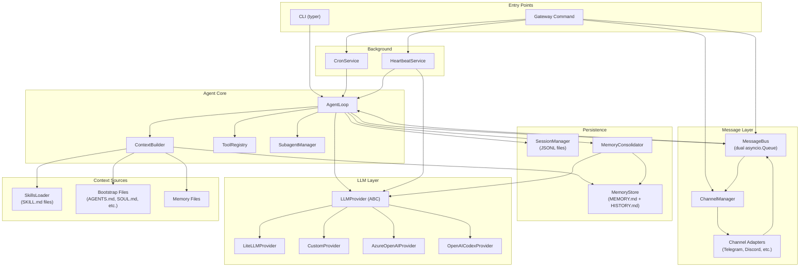
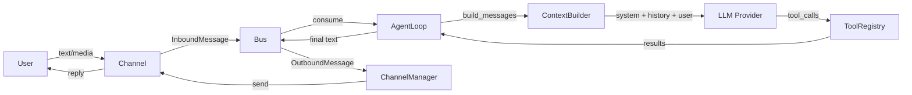

# 00 — Architecture Overview

## One-Paragraph Summary

Nanobot is a single-process, async Python agent framework built around one central `AgentLoop` class that receives messages from an in-process `MessageBus`, constructs LLM prompts by composing system identity, workspace bootstrap files, persistent memory, and skills, calls an LLM via a `LLMProvider` abstraction (primarily LiteLLM), executes tool calls in a synchronous-per-request loop, and routes responses back through the bus to channel adapters (Telegram, Discord, WhatsApp, etc.). The architecture deliberately avoids multi-agent orchestration, planning frameworks, and persistent task queues, achieving its "ultra-lightweight" design by keeping every subsystem as a thin Python class with minimal abstraction layers.

## High-Level System Decomposition

## Main Runtime Entrypoints

| Entrypoint | Code Location | Purpose |
|---|---|---|
| `nanobot onboard` | `cli/commands.py:264` | Initialize config + workspace |
| `nanobot agent` | `cli/commands.py:652` | Direct CLI chat (single or interactive) |
| `nanobot gateway` | `cli/commands.py:457` | Full runtime: agent + channels + cron + heartbeat |
| `nanobot status` | `cli/commands.py:1012` | Show config/provider status |
| `nanobot channels status` | `cli/commands.py:843` | Show channel enable/disable state |

The true runtime entrypoint is `nanobot/__main__.py` → `cli.commands:app` (typer application).

## Main Control Flow

**Normal user-driven request (gateway mode):**

1. Channel adapter receives message → publishes `InboundMessage` to `MessageBus.inbound`
2. `AgentLoop.run()` consumes from inbound queue
3. Dispatch to `_process_message()` under global `_processing_lock`
4. Load/create session via `SessionManager`
5. Run token-based memory consolidation if needed
6. Build context: system prompt + history + current message via `ContextBuilder`
7. Enter `_run_agent_loop()`: call LLM → handle tool calls → repeat until text response
8. Save turn to session, schedule background consolidation
9. Publish `OutboundMessage` to `MessageBus.outbound`
10. `ChannelManager._dispatch_outbound()` routes to correct channel adapter

## Main Data Flow

## Recommended Reading Order for New Engineers

1. **`nanobot/__main__.py`** (9 lines) — The true entrypoint
2. **`cli/commands.py` → `gateway()` function** (~200 lines) — How everything is wired
3. **`agent/loop.py` → `AgentLoop` class** — The control center
4. **`agent/context.py` → `ContextBuilder`** — How prompts are assembled
5. **`agent/tools/registry.py`** — How tools are registered and executed
6. **`bus/events.py` + `bus/queue.py`** — The message protocol
7. **`channels/base.py` + `channels/manager.py`** — Channel adapter pattern
8. **`agent/memory.py`** — The persistence and consolidation model
9. **`config/schema.py`** — The entire config surface
10. **`providers/base.py` + `providers/litellm_provider.py`** — LLM abstraction layer

## Key Architectural Decisions

- **Single-process, single-event-loop**: No multi-process workers, no external message queue
- **Global processing lock**: Only one message processed at a time per agent (`_processing_lock`)
- **LLM-driven memory consolidation**: Memory management itself uses LLM calls
- **Filesystem-as-database**: Sessions (JSONL), memory (Markdown), cron jobs (JSON)
- **Tool-centric agent**: The agent is fundamentally an LLM + tool loop; no explicit planning, reflection, or multi-step reasoning
- **Skills as prompt assets**: Skills are Markdown files injected into the system prompt, not executable code
- **LiteLLM as provider abstraction**: Most LLM routing goes through LiteLLM; only Custom and Azure bypass it
