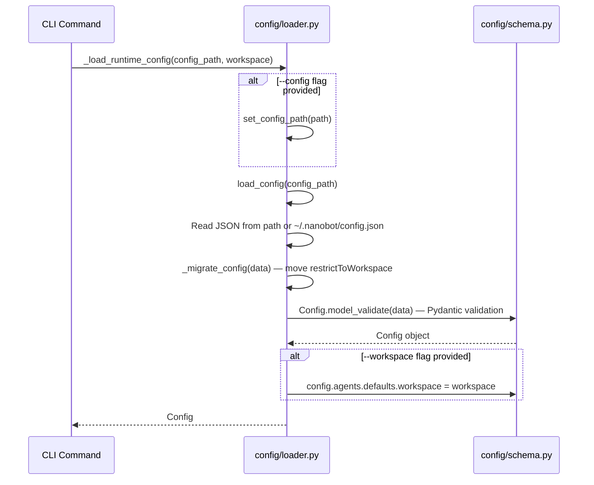

# 02 — Boot Sequence

## Boot Paths

Nanobot has three main boot paths, all rooted in `cli/commands.py`:

### `nanobot onboard`

```
__main__.py → app() → onboard()
  ├── load_config() or Config() — create/merge config
  ├── save_config() — write to ~/.nanobot/config.json
  ├── _onboard_plugins() — inject default channel configs
  ├── sync_workspace_templates() — seed AGENTS.md, SOUL.md, etc.
  └── Print next steps
```

**Code**: `cli/commands.py:264-323`

This is a setup-only command. No agent, no bus, no providers.

### `nanobot agent -m "message"` (Single Message)

```
__main__.py → app() → agent()
  ├── _load_runtime_config() → Config
  ├── sync_workspace_templates()
  ├── MessageBus()
  ├── _make_provider() → LLMProvider
  ├── CronService(store_path)
  ├── AgentLoop(bus, provider, workspace, ...)
  │   ├── ContextBuilder(workspace)
  │   ├── SessionManager(workspace)
  │   ├── ToolRegistry()
  │   ├── SubagentManager(provider, workspace, bus, ...)
  │   ├── MemoryConsolidator(workspace, provider, ...)
  │   └── _register_default_tools()
  │       ├── ReadFileTool, WriteFileTool, EditFileTool, ListDirTool
  │       ├── ExecTool
  │       ├── WebSearchTool, WebFetchTool
  │       ├── MessageTool
  │       ├── SpawnTool
  │       └── CronTool (if cron_service provided)
  ├── agent_loop.process_direct(message)
  │   ├── _connect_mcp() — lazy MCP connection
  │   └── _process_message() → response
  └── close_mcp()
```

**Code**: `cli/commands.py:652-723`

### `nanobot agent` (Interactive)

Same initialization as single message, plus:

```
  ├── _init_prompt_session() — prompt_toolkit with FileHistory
  ├── agent_loop.run() — bus consumer task
  ├── _consume_outbound() — outbound dispatcher task
  └── Interactive loop:
      ├── _read_interactive_input_async() — prompt_toolkit input
      ├── bus.publish_inbound(InboundMessage)
      ├── Wait for turn_done event
      └── _print_agent_response()
```

**Code**: `cli/commands.py:724-831`

### `nanobot gateway` (Full Runtime)

```
__main__.py → app() → gateway()
  ├── _load_runtime_config() → Config
  ├── sync_workspace_templates()
  ├── MessageBus()
  ├── _make_provider() → LLMProvider
  ├── SessionManager(workspace)
  ├── CronService(store_path) — creates scheduler
  ├── AgentLoop(bus, provider, ..., cron_service, session_manager, mcp_servers, ...)
  ├── Set cron.on_job callback (binds to agent.process_direct)
  ├── ChannelManager(config, bus)
  │   └── _init_channels() — discover_all() → instantiate enabled channels
  ├── HeartbeatService(workspace, provider, on_execute, on_notify, ...)
  ├── async run():
  │   ├── cron.start()
  │   ├── heartbeat.start()
  │   └── asyncio.gather(agent.run(), channels.start_all())
  └── finally: close_mcp(), heartbeat.stop(), cron.stop(), agent.stop(), channels.stop_all()
```

**Code**: `cli/commands.py:457-642`

## Config Loading Sequence



## Initialization Order

1. **Config loaded** — `_load_runtime_config()` (`cli/commands.py:423-439`)
2. **Workspace synced** — `sync_workspace_templates()` (`utils/helpers.py:181-211`)
3. **Bus created** — `MessageBus()` (`bus/queue.py:16-18`)
4. **Provider created** — `_make_provider(config)` (`cli/commands.py:364-420`)
5. **SessionManager created** — workspace-local session store
6. **CronService created** — loads jobs from `~/.nanobot/cron/jobs.json`
7. **AgentLoop created** — wires everything together
   - Context, sessions, tools, subagent manager, memory consolidator all created in `__init__`
   - Default tools registered synchronously
8. **MCP connection** — **lazy**, first message triggers `_connect_mcp()`
9. **Cron callback set** — after agent creation (needs agent reference)
10. **ChannelManager created** — discovers and instantiates enabled channels
11. **HeartbeatService created** — receives callbacks bound to agent
12. **Services started** — cron.start(), heartbeat.start(), then agent.run() + channels.start_all()

## Lazy vs Eager Initialization

| Component | Initialization | Details |
|---|---|---|
| Config | Eager | Loaded from JSON at CLI startup |
| Provider | Eager | Created before AgentLoop |
| ToolRegistry | Eager | Default tools registered in `__init__` |
| MCP servers | **Lazy** | Connected on first message (`_connect_mcp`) |
| Sessions | **Lazy per key** | Created via `get_or_create()` on first access |
| Memory files | **Lazy** | Created on first consolidation |
| Channel adapters | Eager | All enabled channels instantiated in `ChannelManager.__init__` |
| Cron jobs | Eager | Loaded from disk in `start()` |

## Provider Creation (`_make_provider`)

```
_make_provider(config) → LLMProvider
  ├── Extract model name from config
  ├── config.get_provider_name(model) → provider_name
  ├── config.get_provider(model) → ProviderConfig (api_key, api_base, extra_headers)
  ├── Switch on provider_name:
  │   ├── "openai_codex" → OpenAICodexProvider
  │   ├── "custom" → CustomProvider
  │   ├── "azure_openai" → AzureOpenAIProvider
  │   └── else → LiteLLMProvider (default path)
  └── Apply GenerationSettings (temperature, max_tokens, reasoning_effort)
```

**Code**: `cli/commands.py:364-420`
