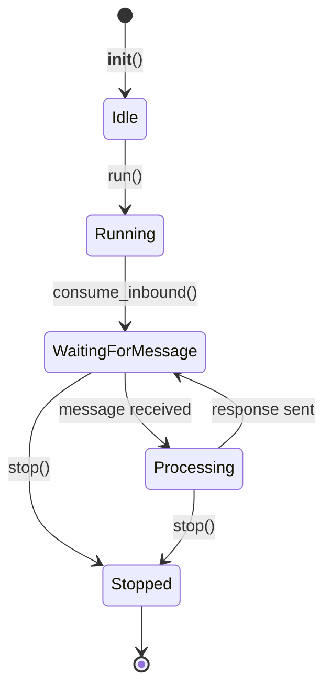

# 03 — Agent Control Loop

## Core Class: `AgentLoop`

**File**: `agent/loop.py` (511 lines)

The `AgentLoop` class is the central runtime of nanobot. Everything flows through it.

## Lifecycle



## Main Entry Points

| Method | Purpose | Called By |
|---|---|---|
| `run()` | Continuous bus consumer loop | `gateway()`, interactive `agent` |
| `process_direct()` | One-shot message processing | CLI `agent -m`, cron, heartbeat |
| `stop()` | Graceful shutdown | Gateway shutdown, signal handlers |

## `run()` — Bus Consumer Loop

```python
# Simplified pseudocode (agent/loop.py:92-117)
async def run():
    _connect_mcp()  # Lazy MCP initialization
    while True:
        msg = await bus.consume_inbound()  # Blocks until message
        async with _processing_lock:       # Global exclusion
            try:
                _set_current_context(msg)
                response = await _process_message(msg)
                # Publish response to outbound queue
                await bus.publish_outbound(OutboundMessage(...))
            except Exception:
                logger.exception()
```

## `_process_message()` — The Core Processing Pipeline

This is the most important method in the entire codebase.

```python
# Simplified pseudocode (agent/loop.py:134-242)
async def _process_message(msg: InboundMessage) -> str:
    session = session_manager.get_or_create(msg.session_key)
    
    # --- Message Tool Context ---
    message_tool.set_context(msg.channel, msg.chat_id, msg.metadata.get("message_id"))
    message_tool.start_turn()
    spawn_tool.set_context(msg.channel, msg.chat_id)
    
    # --- Consolidation Check ---
    await _maybe_consolidate(session)  # Token-budget check
    
    # --- Build LLM Messages ---
    messages = context.build_messages(session, msg.content, msg.media, msg.metadata)
    
    # --- Run Agent Loop (LLM + tools) ---
    response, tool_calls_session = await _run_agent_loop(
        messages, session, msg
    )
    
    # --- Persist Turn ---
    await _save_turn(session, msg, response, tool_calls_session)
    
    # --- Post-Turn Consolidation ---
    _schedule_consolidation_if_needed(session, msg.session_key)
    
    return response
```

## `_run_agent_loop()` — LLM Interaction Loop

```python
# Simplified pseudocode (agent/loop.py:260-365)
async def _run_agent_loop(messages, session, msg) -> (str, list):
    tool_calls_session = []
    
    for iter_count in range(MAX_ITERATIONS):  # Default 25
        # --- Call LLM ---
        response = await provider.chat_with_retry(
            messages=messages,
            tools=tools_registry.get_definitions(),
            model=config_model,
        )
        
        # --- No tool calls → return text ---
        if not response.has_tool_calls:
            return response.content, tool_calls_session
        
        # --- Has tool calls → execute them ---
        # Build assistant message with tool_calls
        assistant_msg = build_assistant_message(response.content, tool_calls, ...)
        messages.append(assistant_msg)
        
        for tc in response.tool_calls:
            # Execute tool
            result = await tools_registry.execute(tc.name, tc.arguments)
            
            # Publish progress hint to channel
            await _publish_tool_progress(msg, tc.name)
            
            # Build tool result message
            messages.append({
                "role": "tool",
                "tool_call_id": tc.id,
                "content": result,
                "name": tc.name,
            })
            
            tool_calls_session.append({
                "name": tc.name,
                "arguments": tc.arguments,
                "result": result,
            })
    
    # Max iterations exceeded
    return "Max iterations reached", tool_calls_session
```

## `_save_turn()` — Session Persistence

```python
# Simplified pseudocode (agent/loop.py:371-432)
async def _save_turn(session, msg, response, tool_calls_session):
    # Add user message to session
    session.add_message("user", msg.content)
    
    # Add tool call messages (if any)
    for tc_group in tool_calls_session:
        session.add_message("assistant", content=None, tool_calls=[...])
        session.add_message("tool", content=tc_group["result"], ...)
    
    # Add final assistant response
    session.add_message("assistant", response)
    
    # Save to disk (JSONL)
    session_manager.save(session)
```

## State Mutations During Processing

| Phase | Reads | Mutates |
|---|---|---|
| Session load | JSONL file | In-memory cache |
| Consolidation | Session messages | MEMORY.md, HISTORY.md, `last_consolidated` |
| Context build | AGENTS.md, SOUL.md, USER.md, TOOLS.md, MEMORY.md, skills | None (read-only) |
| LLM call | Provider state, message list | None |
| Tool execution | Varies per tool | Filesystem, shell, network, etc. |
| Save turn | None | Session messages, JSONL file |

## Concurrency Model

```
_processing_lock = asyncio.Lock()
```

**One message at a time per agent instance.** The global `_processing_lock` (line 27) ensures no concurrent message processing. This means:

- No request parallelism
- Channel messages queue up in the asyncio.Queue
- Background tasks (heartbeat, cron) compete for the same lock
- Subagents spawn **separate** `AgentLoop` instances (different lock)

## Tool Call Execution Model

Tools are executed **sequentially within a turn**, **one at a time**:

```
LLM response
  ├── tool_call_1 → execute → result
  ├── tool_call_2 → execute → result  
  └── tool_call_3 → execute → result
All results → append to messages → re-call LLM
```

There is **no parallel tool execution**. Each tool call blocks until completion.

## Progress Reporting

During tool execution, the agent publishes progress hints to the outbound bus:

```python
async def _publish_tool_progress(msg, tool_name):
    await bus.publish_outbound(OutboundMessage(
        channel=msg.channel,
        chat_id=msg.chat_id,
        content=f"🔧 {tool_name}",
        metadata={"_progress": True, "_tool_hint": True},
    ))
```

These are filtered by `ChannelManager._dispatch_outbound()` based on `send_tool_hints` and `send_progress` config flags.

## Max Iterations Safety

```python
MAX_ITERATIONS = 25  # Hardcoded in AgentLoop._run_agent_loop (line 260)
```

If the LLM keeps requesting tool calls beyond 25 iterations, the loop breaks and returns an error message. This prevents runaway tool-call loops.

## Error Handling Strategy

- **LLM errors**: Caught by `_safe_chat()` → returns `LLMResponse(finish_reason="error")`
- **Transient errors**: Retried with exponential backoff (1s, 2s, 4s delays)
- **Tool errors**: Caught by `ToolRegistry.execute()` → returns error string with hint
- **Processing errors**: Caught at `_dispatch()` level → logged, no crash
- **MCP errors**: Per-tool timeout + cancellation handling
