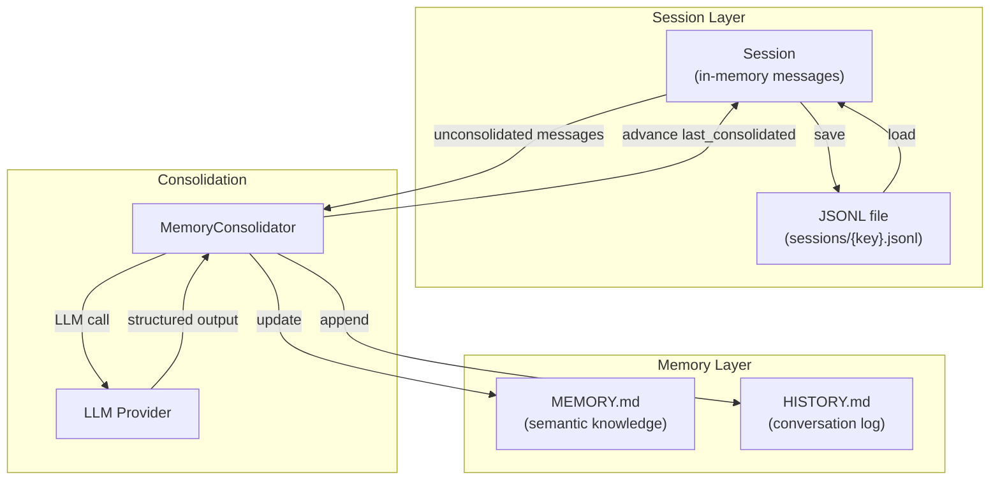

# 04 — Memory System

## Overview

Nanobot implements a two-layer memory model:

1. **Session history** — Append-only JSONL message log per conversation
2. **Consolidated memory** — Summarized knowledge in `MEMORY.md` and `HISTORY.md`

The consolidation process itself uses LLM calls to compress old messages into structured summaries.

## Architecture



## Session Model (`session/manager.py`)

### `Session` Dataclass

| Field | Type | Purpose |
|---|---|---|
| `key` | `str` | Session identifier (e.g., `telegram:12345`) |
| `messages` | `list[dict]` | **Append-only** message history |
| `last_consolidated` | `int` | Index of last consolidated message |
| `metadata` | `dict` | Arbitrary session metadata |
| `created_at` / `updated_at` | `datetime` | Timestamps |

### Key Design: Append-Only Messages

```
Messages: [m0, m1, m2, m3, m4, m5, m6, m7, m8, m9]
                      ↑                              ↑
               last_consolidated=3              current tail
               (m0-m2 already in MEMORY.md)
```

Messages are **never removed** from the session. The `last_consolidated` pointer tracks which messages have been compressed into MEMORY.md/HISTORY.md.

### `get_history(max_messages=500)` — What Goes to LLM

1. Slice `messages[last_consolidated:]` — only unconsolidated messages
2. Apply `max_messages` window (keeps last N)
3. Trim to start at first `user` message (avoid mid-turn starts)
4. `_find_legal_start()` — skip orphan tool results where the matching `assistant` tool_calls message fell outside the window

This ensures the LLM never sees stale consolidated content in the message history.

### JSONL Persistence

Sessions are stored as JSONL (one JSON object per line):

```jsonl
{"_type": "metadata", "key": "telegram:12345", "created_at": "...", "last_consolidated": 3}
{"role": "user", "content": "hello", "timestamp": "..."}
{"role": "assistant", "content": "Hi there!", "timestamp": "..."}
```

The first line is always a metadata record. Subsequent lines are messages. The entire file is rewritten on every save (no append-only on disk).

## MemoryStore (`agent/memory.py:14-84`)

Thin abstraction over `MEMORY.md` and `HISTORY.md`:

```python
class MemoryStore:
    def read_memory() -> str     # Read MEMORY.md
    def read_history() -> str    # Read HISTORY.md
    def write_memory(content)    # Write MEMORY.md
    def append_to_history(entry) # Append to HISTORY.md
    def clear_memory()           # Reset MEMORY.md to template
    def memory_stats() -> dict   # Line/char counts
```

Both files live under `workspace/memory/`.

## MemoryConsolidator (`agent/memory.py:87-358`)

### Consolidation Trigger

```python
# agent/loop.py → _maybe_consolidate()
async def _maybe_consolidate(session):
    unconsolidated = len(session.messages) - session.last_consolidated
    if unconsolidated >= consolidation_threshold:  # Default: 50 messages
        await memory_consolidator.consolidate(session)
```

### Consolidation Algorithm

```python
# Simplified pseudocode (agent/memory.py:193-300)
async def consolidate(session):
    messages = session.messages[session.last_consolidated:]
    
    # Build conversation text for LLM
    conversation_text = _format_messages(messages)
    
    # Read current MEMORY.md
    current_memory = memory_store.read_memory()
    
    # Ask LLM to update memory
    response = await provider.chat_with_retry(
        messages=[
            {"role": "system", "content": CONSOLIDATION_SYSTEM_PROMPT},
            {"role": "user", "content": f"""
                Current memory:
                {current_memory}
                
                New conversation:
                {conversation_text}
                
                Update the memory file with key facts, preferences, and context.
            """},
        ],
        tools=CONSOLIDATION_TOOLS,  # Structured output via tool call
        model=model_name,
    )
    
    # Parse tool call response
    if response.has_tool_calls:
        args = response.tool_calls[0].arguments
        updated_memory = args["memory_content"]
        history_entry = args["history_entry"]
        
        # Write updated memory
        memory_store.write_memory(updated_memory)
        memory_store.append_to_history(history_entry)
    
    # Advance consolidation pointer
    session.last_consolidated = len(session.messages)
    session_manager.save(session)
```

### Consolidation Prompt Structure

The consolidation uses a structured tool call with two outputs:

1. **`memory_content`** — Full replacement for MEMORY.md (semantic knowledge: user preferences, ongoing projects, key facts)
2. **`history_entry`** — Append-only entry for HISTORY.md (timestamped conversation summary)

### Token Budget Management

Before running the full agent loop, `_maybe_consolidate()` checks:

```python
estimated_tokens = estimate_prompt_tokens(messages, tools)
if estimated_tokens > max_context_window * 0.8:  # 80% threshold
    await consolidate(session)
```

This is the primary backpressure mechanism for context window overflow.

## Memory Files

### MEMORY.md (Semantic Memory)

**Purpose**: Long-term knowledge about the user, their preferences, ongoing projects, and important context.

**Format**: Free-form Markdown, fully rewritten on each consolidation.

**Template** (`templates/memory/MEMORY.md`):
```markdown
# Memory
## User Preferences
## Ongoing Projects
## Important Context
```

### HISTORY.md (Conversation Log)

**Purpose**: Chronological record of past conversations.

**Format**: Append-only Markdown with timestamped entries.

Initially empty. Each consolidation appends:
```markdown
## [2026-03-18 12:30]
Brief summary of what was discussed...
```

## How Memory Enters the LLM Context

Memory appears in the system prompt via `ContextBuilder.build_messages()`:

```
System prompt components (in order):
1. AGENTS.md — global instructions
2. SOUL.md — personality
3. USER.md — user profile
4. MEMORY.md — accumulated knowledge  ← HERE
5. TOOLS.md — tool usage notes
6. Skills content — always-load skills
7. Runtime context — time, OS info, skills summary
```

HISTORY.md is **not** included in the system prompt. It is a write-only archive.

## Design Properties

| Property | Value |
|---|---|
| Message persistence | JSONL files, full rewrite on save |
| Memory persistence | Markdown files |
| Consolidation trigger | Message count threshold (default 50) |
| Consolidation method | LLM-driven summarization |
| Context window protection | Token budget check before each turn |
| History inclusion | Only unconsolidated messages sent to LLM |
| Concurrent consolidation | Not supported — runs under `_processing_lock` |

## Trade-offs

**Strengths**:
- Simple, file-based, easily inspectable
- LLM-driven consolidation preserves semantic meaning
- Clean separation of hot (session) vs cold (memory) storage

**Weaknesses**:
- Full file rewrite on every session save — O(n) disk I/O
- No deduplication in MEMORY.md — consolidation may repeat information
- Memory consolidation uses LLM tokens (cost and latency)
- If consolidation fails, the pointer doesn't advance → retry on next trigger
- JSONL format not truly append-only on disk (despite append-only semantics in memory)
