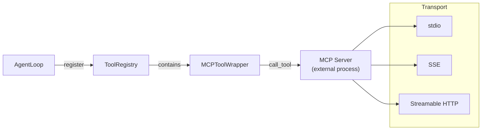
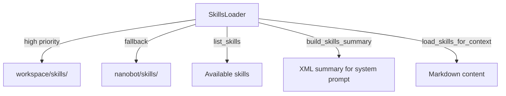

# 05 — Skills and Tools System

## Two Distinct Concepts

| | Skills | Tools |
|---|---|---|
| Nature | **Prompt assets** (Markdown) | **Executable code** (Python classes) |
| Purpose | Teach the agent *how* to use tools | Provide *what* the agent can do |
| Runtime | Injected into system prompt | Called by LLM tool-call mechanism |
| Location | `workspace/skills/`, `nanobot/skills/` | `agent/tools/` |
| Interface | YAML frontmatter + Markdown body | Tool ABC + OpenAI function schema |

## Tools System

### Tool ABC (`agent/tools/base.py`)

```python
class Tool(ABC):
    @property
    def name(self) -> str: ...           # e.g., "exec"
    @property
    def description(self) -> str: ...    # For LLM function calling
    @property
    def parameters(self) -> dict: ...    # JSON Schema
    
    async def execute(self, **kwargs) -> str: ...  # Execution
    def validate_params(self, params) -> list[str]: ...  # Validation
    def cast_params(self, params) -> dict: ...  # Type coercion
    def to_schema(self) -> dict: ...     # OpenAI function format
```

### Built-in Tools

| Tool | File | Purpose |
|---|---|---|
| `read_file` | `filesystem.py` | Read file contents with encoding detection |
| `write_file` | `filesystem.py` | Create/overwrite files |
| `edit_file` | `filesystem.py` | Patch files with search-replace |
| `list_dir` | `filesystem.py` | List directory contents |
| `exec` | `shell.py` | Execute shell commands |
| `web_search` | `web.py` | DuckDuckGo web search |
| `web_fetch` | `web.py` | Fetch URL content with readability |
| `message` | `message.py` | Send message to channel |
| `spawn` | `spawn.py` | Create background subagent |
| `cron_*` | `cron.py` | Schedule/manage cron jobs |
| `mcp_*` | `mcp.py` | MCP server tools (dynamic) |

### Tool Registration

Default tools are registered in `AgentLoop.__init__()`:

```python
def _register_default_tools(self):
    registry.register(ReadFileTool(encoding="utf-8"))
    registry.register(WriteFileTool())
    registry.register(EditFileTool())
    registry.register(ListDirTool())
    registry.register(ExecTool(
        timeout=config.exec.timeout,
        working_dir=workspace,
        deny_patterns=config.exec.deny_patterns,
        restrict_to_workspace=config.exec.restrict_to_workspace,
    ))
    registry.register(WebSearchTool())
    registry.register(WebFetchTool())
    registry.register(MessageTool(send_callback=bus.publish_outbound))
    registry.register(SpawnTool(subagent_manager))
    if cron_service:
        registry.register(CronTool(cron_service))
```

### ToolRegistry (`agent/tools/registry.py`)

Simple dict-based registry:

```python
class ToolRegistry:
    _tools: dict[str, Tool]
    
    def register(tool) -> None
    def execute(name, params) -> str:
        tool = _tools[name]
        params = tool.cast_params(params)  # Type coercion
        errors = tool.validate_params(params)  # Schema validation
        if errors:
            return "Error: ..."
        result = await tool.execute(**params)
        if result.startswith("Error"):
            result += "\n\n[Analyze the error above and try a different approach.]"
        return result
    
    def get_definitions() -> list[dict]:
        return [tool.to_schema() for tool in _tools.values()]
```

### Tool Execution Details

#### Safety Guards (ExecTool)

The shell tool (`agent/tools/shell.py`) implements multiple safety layers:

1. **Deny patterns** — regex-based blocking of dangerous commands:
   - `rm -rf`, `del /f`, `format`, `mkfs`, `dd`, `shutdown`, fork bomb
2. **Allow patterns** — optional whitelist mode
3. **Workspace restriction** — blocks paths outside working directory
4. **Path traversal detection** — blocks `../` and `..\\`
5. **SSRF protection** — blocks internal/private URLs via `security/network.py`
6. **Timeout** — default 60s, max 600s
7. **Output truncation** — head+tail truncation at 10,000 chars

#### Filesystem Tools

- **`read_file`**: encoding auto-detection via `chardet`, binary detection, line range support
- **`write_file`**: atomic write (write to file directly, no temp file)
- **`edit_file`**: search-replace with exact match or fuzzy matching fallback
- **`list_dir`**: returns formatted tree with size hints

#### Web Tools

- **`web_search`**: Uses `ddgs` (DuckDuckGo Search) library
- **`web_fetch`**: SSRF-validated HTTP fetch → `readability-lxml` → Markdown conversion

### MCP Integration (`agent/tools/mcp.py`)

MCP (Model Context Protocol) servers are external processes that expose tools:



**Connection** (`connect_mcp_servers()`):
1. Read `mcp_servers` config
2. Auto-detect transport type: `stdio` (has command), `sse` (URL ending /sse), `streamableHttp` (other URL)
3. Connect via MCP SDK client
4. List tools from server
5. Filter by `enabledTools` config
6. Wrap each as `MCPToolWrapper` → register in `ToolRegistry`
7. Name pattern: `mcp_{server_name}_{tool_name}`

**Execution**: `MCPToolWrapper.execute()` calls `session.call_tool()` with the **original** tool name (not the wrapped name), with configurable timeout.

## Skills System

### Skill Discovery (`agent/skills.py`)



### Skill File Format

```yaml
---
name: cron
description: How to schedule reminders and cron jobs
metadata: '{"nanobot": {"requires": {"bins": ["cron"]}, "always": true}}'
---

# Skill content in Markdown...
```

### Skill Loading Modes

1. **Always-load** (`always: true` in metadata) — skill content is included in every system prompt
2. **Progressive loading** — only an XML summary is included; the agent uses `read_file` tool to load full content on demand

### XML Skills Summary (injected into system prompt)

```xml
<skills>
  <skill available="true">
    <name>cron</name>
    <description>How to schedule reminders and cron jobs</description>
    <location>/path/to/SKILL.md</location>
  </skill>
  <skill available="false">
    <name>github</name>
    <description>GitHub workflow integration</description>
    <location>/path/to/SKILL.md</location>
    <requires>ENV: GITHUB_TOKEN</requires>
  </skill>
</skills>
```

### Skill Requirements

Skills can declare requirements in their frontmatter metadata:

- **`bins`** — CLI tools that must be in PATH (checked via `shutil.which`)
- **`env`** — Environment variables that must be set

Unavailable skills are still listed in the summary (with `available="false"`) so the agent knows they exist but can't use them.

### Built-in Skills

| Skill | Always | Description |
|---|---|---|
| `cron` | Yes | Cron job scheduling instructions |
| `memory` | No | Memory management guidance |
| `github` | No | GitHub CLI integration |
| `summarize` | No | Content summarization |
| `skill-creator` | No | Meta-skill for creating new skills |
| `weather` | No | Weather lookup |
| `tmux` | No | Tmux session management |
| `clawhub` | No | ClawHub integration |
