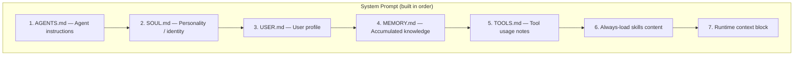

# 06 — Context Construction and Reasoning Scaffold

## Overview

The `ContextBuilder` (`agent/context.py`, 196 lines) assembles the complete prompt that the LLM receives on each turn. It composes multiple sources into a structured system prompt plus a user message (potentially with media).

## System Prompt Assembly Order



## Context Sources

### 1. Bootstrap Files (workspace-level)

| File | Purpose | Loaded From |
|---|---|---|
| `AGENTS.md` | Agent behavioral instructions | `workspace/AGENTS.md` |
| `SOUL.md` | Personality, values, communication style | `workspace/SOUL.md` |
| `USER.md` | User profile: name, timezone, preferences | `workspace/USER.md` |
| `MEMORY.md` | Accumulated facts from conversations | `workspace/memory/MEMORY.md` |
| `TOOLS.md` | Non-obvious tool constraints and patterns | `workspace/TOOLS.md` |

These files are read fresh on every `build_messages()` call — no caching.

### 2. Skills Content

Always-loaded skills (skills with `always: true` in metadata) are injected directly into the system prompt. Other skills appear only as an XML summary so the agent can load them on demand.

### 3. Runtime Context Block

A dynamic block injected at the end of the system prompt:

```python
runtime_context = f"""
<runtime_context>
Current Time: {current_time_str()}
Operating System: {platform.system()} {platform.release()}
Working Directory: {workspace}
{skills_summary}
</runtime_context>
"""
```

## `build_messages()` — Full Assembly

```python
# Simplified pseudocode (agent/context.py:45-120)
def build_messages(session, user_content, media, metadata) -> list[dict]:
    # --- System prompt ---
    system_parts = []
    
    # 1. Bootstrap files
    for filename in ("AGENTS.md", "SOUL.md", "USER.md", "MEMORY.md", "TOOLS.md"):
        content = read_workspace_file(filename)
        if content:
            system_parts.append(content)
    
    # 2. Always-loaded skills
    always_skills = skills_loader.get_always_skills()
    if always_skills:
        skills_content = skills_loader.load_skills_for_context(always_skills)
        system_parts.append(skills_content)
    
    # 3. Runtime context
    system_parts.append(build_runtime_context())
    
    system_prompt = "\n\n".join(system_parts)
    
    # --- Conversation history ---
    history = session.get_history()
    
    # --- Current user message ---
    user_msg = build_user_message(user_content, media, metadata)
    
    # Assemble final messages
    messages = [{"role": "system", "content": system_prompt}]
    messages.extend(history)
    messages.append(user_msg)
    
    return messages
```

## Media Handling

When media (images) are attached, the user message is built as a multipart content array:

```python
def _build_user_message(content, media, metadata):
    if not media:
        return {"role": "user", "content": content}
    
    parts = [{"type": "text", "text": content}]
    for url in media:
        parts.append({
            "type": "image_url",
            "image_url": {"url": url},
            "_meta": {"path": url},
        })
    return {"role": "user", "content": parts}
```

The `_meta` field is stripped before sending to the provider but preserved in session history for debugging / tool reference.

## Message Flow to LLM

```
┌─── System ────────────────────────────────────┐
│ AGENTS.md content                              │
│ ---                                            │
│ SOUL.md content                                │
│ ---                                            │
│ USER.md content                                │
│ ---                                            │
│ MEMORY.md content                              │
│ ---                                            │
│ TOOLS.md content                               │
│ ---                                            │
│ ### Skill: cron                                │
│ [always-loaded skill content]                  │
│ ---                                            │
│ <runtime_context>                              │
│ Current Time: ...                              │
│ Working Directory: /path/to/workspace          │
│ <skills>                                       │
│   <skill available="true">                     │
│     <name>weather</name>                       │
│     ...                                        │
│   </skill>                                     │
│ </skills>                                      │
│ </runtime_context>                             │
├─── History ───────────────────────────────────┤
│ user: previous message 1                       │
│ assistant: previous response 1                 │
│ (tool calls and results from turn 1)           │
│ user: previous message 2                       │
│ assistant: previous response 2                 │
│ ...                                            │
├─── Current ───────────────────────────────────┤
│ user: current message                          │
│ (with optional image_url parts)                │
└────────────────────────────────────────────────┘
```

## Reasoning Capabilities

### Extended Thinking (Anthropic)

The provider layer preserves `thinking_blocks` from Anthropic models:

```python
# providers/base.py
@dataclass
class LLMResponse:
    reasoning_content: str | None = None  # Kimi, DeepSeek-R1
    thinking_blocks: list[dict] | None = None  # Anthropic extended thinking
```

These are stored in session history but stripped before sending to non-Anthropic providers.

### Reasoning Effort Control

```python
# providers/base.py
@dataclass(frozen=True)
class GenerationSettings:
    reasoning_effort: str | None = None  # "low", "medium", "high"
```

Set via config and passed through to `chat_with_retry()`. The `drop_params=True` flag ensures LiteLLM silently drops it for providers that don't support it.

## What Nanobot Does NOT Have

| Feature | Status |
|---|---|
| Multi-agent orchestration | ❌ No inter-agent communication protocol |
| Explicit planning | ❌ No plan-execute-verify loops |
| Self-reflection | ❌ No "think about what went wrong" |
| Retrieval-augmented generation | ❌ No vector DB, no embedding search |
| Chain-of-thought forcing | ❌ No CoT prompts (relies on model capability) |
| Dynamic prompt selection | ❌ Same system prompt for every turn |
| Goal decomposition | ❌ No automatic task breakdown |
| Conversation routing | ❌ All messages go to same agent |

The reasoning strategy is entirely **delegate-to-the-LLM**: the system prompt provides context and tools, and the LLM decides what to do.

## Token Budget Management

Context size is managed reactively:

1. `estimate_prompt_tokens()` in `utils/helpers.py` uses `tiktoken` (cl100k_base encoding)
2. Before each turn, `_maybe_consolidate()` checks if estimated tokens exceed 80% of the context window
3. If over budget, runs memory consolidation to reduce unconsolidated message count
4. The `max_messages` default of 500 in `get_history()` provides a hard upper bound

There is no proactive context pruning or summarization beyond the consolidation mechanism.
