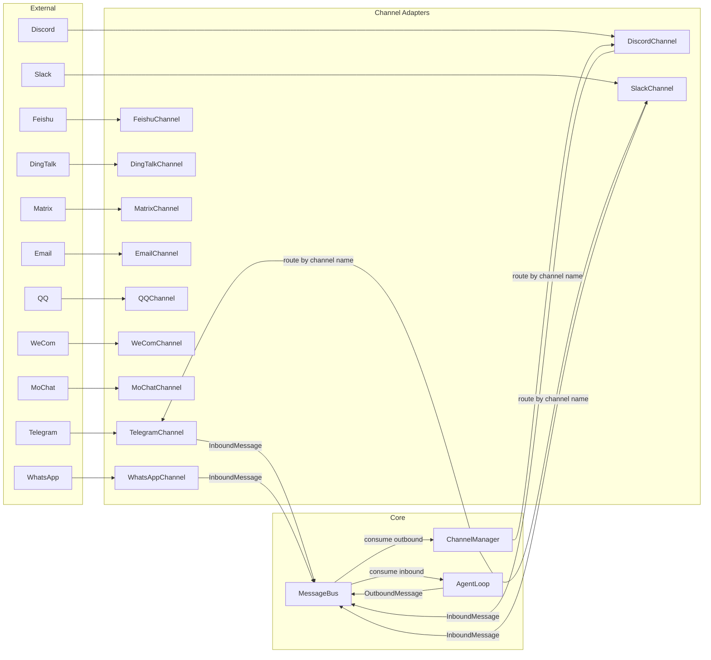

# 07 — Channels, Gateway, and Message Routing

## Architecture



## Message Bus (`bus/queue.py`)

The bus is a pair of unbounded `asyncio.Queue` objects:

```python
class MessageBus:
    inbound: asyncio.Queue[InboundMessage]   # Channels → Agent
    outbound: asyncio.Queue[OutboundMessage]  # Agent → Channels
```

**Properties:**
- In-process only (no Redis, no Kafka)
- Unbounded queues (no backpressure)
- No fan-out (one consumer per queue)
- No persistence (messages lost on crash)
- No message acknowledgment

## Message Types (`bus/events.py`)

### `InboundMessage`

```python
@dataclass
class InboundMessage:
    channel: str              # "telegram", "discord", etc.
    sender_id: str            # User identifier
    chat_id: str              # Chat/channel identifier
    content: str              # Message text
    timestamp: datetime       # When received
    media: list[str]          # Media URLs
    metadata: dict[str, Any]  # Channel-specific data
    session_key_override: str | None  # Thread-scoped sessions

    @property
    def session_key(self) -> str:
        return self.session_key_override or f"{self.channel}:{self.chat_id}"
```

### `OutboundMessage`

```python
@dataclass
class OutboundMessage:
    channel: str              # Target channel name
    chat_id: str              # Target chat/user
    content: str              # Response text
    reply_to: str | None      # Message ID to reply to
    media: list[str]          # Media file paths
    metadata: dict[str, Any]  # Routing metadata
```

## Channel Adapter Contract (`channels/base.py`)

```python
class BaseChannel(ABC):
    name: str = "base"
    display_name: str = "Base"
    transcription_api_key: str = ""
    
    def __init__(self, config, bus: MessageBus): ...
    
    @abstractmethod
    async def start(self) -> None: ...     # Long-running listener
    @abstractmethod
    async def stop(self) -> None: ...      # Cleanup
    @abstractmethod
    async def send(self, msg: OutboundMessage) -> None: ...  # Send response
    
    def is_allowed(self, sender_id: str) -> bool: ...  # Access control
    async def _handle_message(self, sender_id, chat_id, content, media, metadata, session_key) -> None: ...
    async def transcribe_audio(self, file_path) -> str: ...  # Groq Whisper
```

**Access control**: `is_allowed()` checks `allow_from` config list:
- Empty list → deny all
- `["*"]` → allow all
- `["12345", "67890"]` → whitelist specific sender IDs

## Channel Discovery (`channels/registry.py`)

Two discovery mechanisms, merged:

1. **Built-in** — `pkgutil.iter_modules()` scans `nanobot.channels` package for Python files
2. **Plugins** — `importlib.metadata.entry_points(group="nanobot.channels")` discovers installed packages

Built-in channels take priority over plugins (no shadowing).

```python
def discover_all() -> dict[str, type[BaseChannel]]:
    builtin = {}
    for modname in discover_channel_names():
        builtin[modname] = load_channel_class(modname)
    external = discover_plugins()
    # Built-in wins on conflict
    return {**external, **builtin}
```

## ChannelManager (`channels/manager.py`)

### Initialization

```python
class ChannelManager:
    def __init__(self, config: Config, bus: MessageBus):
        self._init_channels()  # Discover and instantiate
        self._validate_allow_from()  # Fail if empty allow_from
```

### Outbound Dispatch Loop

```python
async def _dispatch_outbound(self):
    while True:
        msg = await bus.consume_outbound()
        
        # Filter progress/tool hints based on config
        if msg.metadata.get("_progress"):
            if msg.metadata.get("_tool_hint") and not config.channels.send_tool_hints:
                continue
            if not msg.metadata.get("_tool_hint") and not config.channels.send_progress:
                continue
        
        channel = self.channels.get(msg.channel)
        if channel:
            await channel.send(msg)
```

### Progress Filtering

| Config Flag | Controls |
|---|---|
| `send_progress` | Agent "thinking" status messages |
| `send_tool_hints` | Tool execution hints (e.g., "🔧 exec") |

Both default to `True` in the config schema.

## Supported Channels

| Channel | File | Lines | Notable |
|---|---|---|---|
| Telegram | `telegram.py` | ~700 | Largest community, full media support |
| Discord | `discord.py` | ~250 | Thread-scoped sessions |
| Slack | `slack.py` | ~300 | Socket mode, thread support |
| WhatsApp | `whatsapp.py` | ~200 | Uses Node.js bridge via Socket.IO |
| Feishu | `feishu.py` | ~1100 | Largest file, complex card messaging |
| DingTalk | `dingtalk.py` | ~200 | Stream mode SDK |
| Matrix | `matrix.py` | ~350 | E2E encryption support |
| Email | `email.py` | ~300 | IMAP polling + SMTP send |
| MoChat | `mochat.py` | ~800 | WeChat mini-program bridge |
| WeCom | `wecom.py` | ~200 | Enterprise WeChat SDK |
| QQ | `qq.py` | ~250 | QQ Bot SDK |

## Session Key Routing

Session keys determine memory isolation:

| Pattern | Meaning |
|---|---|
| `telegram:12345` | Default: one session per chat |
| `telegram:12345:thread_67890` | Thread-scoped: separate session per thread |
| `cli:direct` | Direct CLI interaction |
| `cli:interactive` | Interactive CLI mode |

The `session_key_override` field in `InboundMessage` enables thread-level session isolation (used by Discord and Slack thread support).

## WhatsApp Architecture (Special Case)

WhatsApp uses a separate Node.js bridge process (`bridge/`):

```
WhatsApp Web ↔ whatsapp-web.js ↔ Socket.IO ↔ nanobot (Python)
```

The bridge handles WhatsApp web session management, and communicates with the Python channel adapter via Socket.IO messages. This is the only channel that requires an external process.
