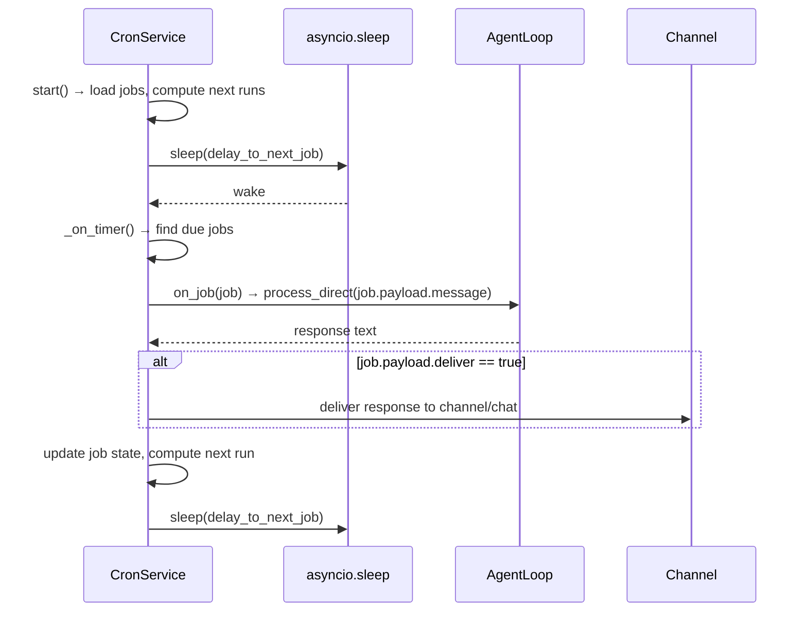
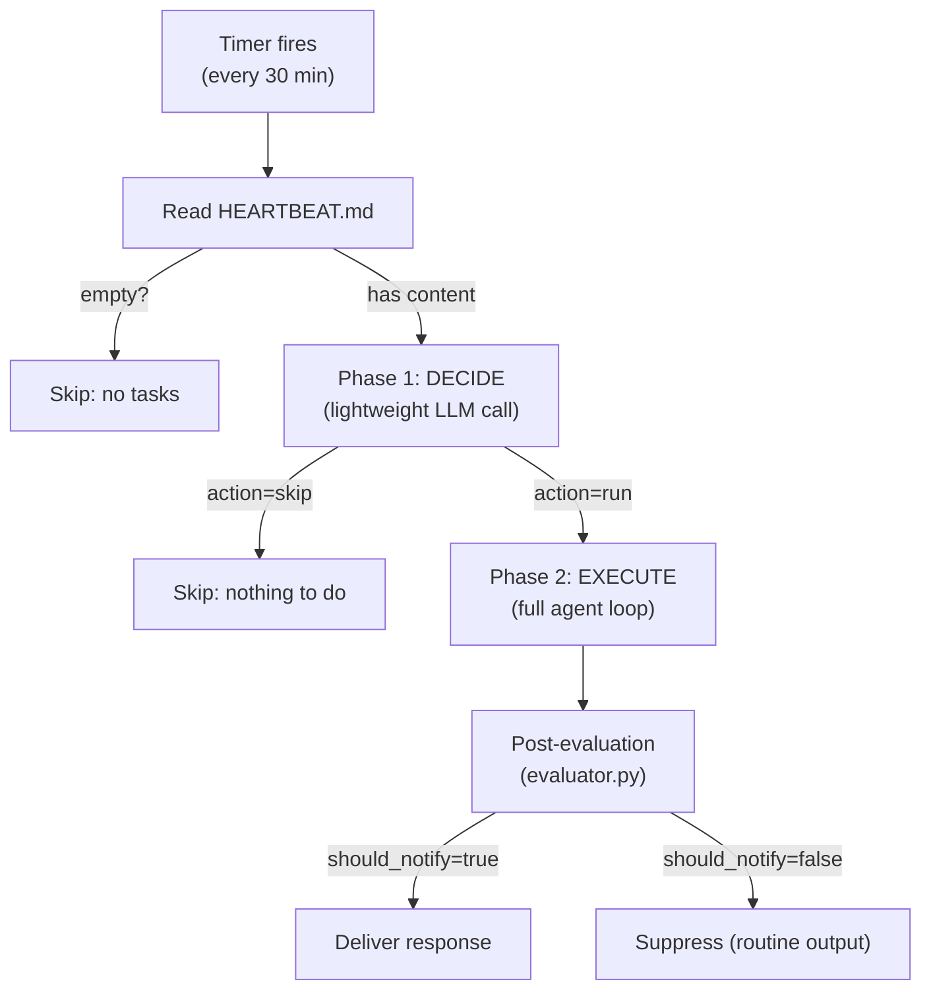
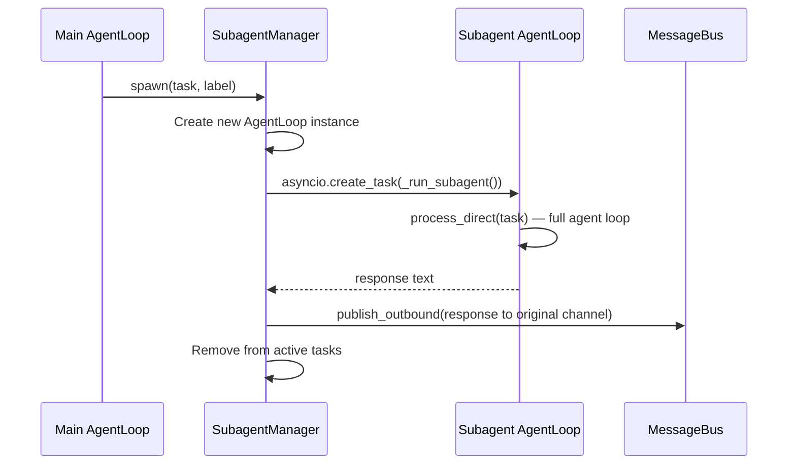
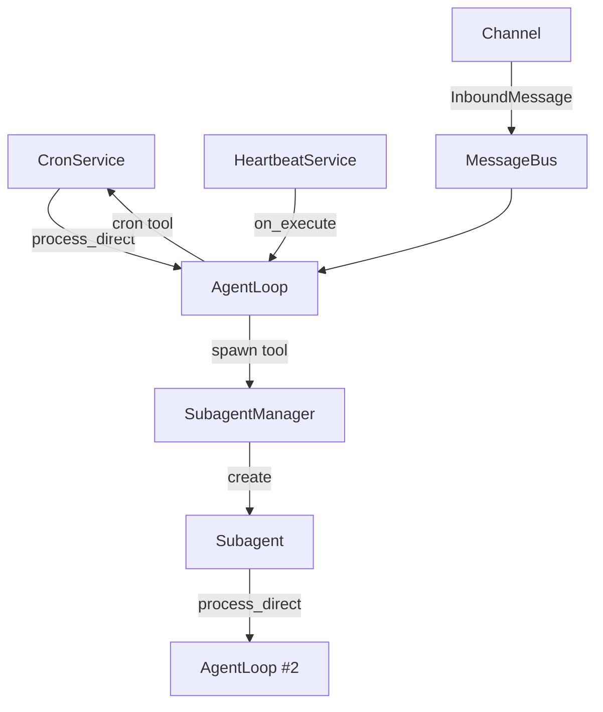

# 08 — Proactive Runtime: Cron, Heartbeat, and Subagents

## Three Proactive Mechanisms

Nanobot has three mechanisms for autonomous (non-user-initiated) work:

| Mechanism | Trigger | Purpose | File |
|---|---|---|---|
| **Cron** | Time-based schedule | Run scheduled tasks | `cron/service.py` |
| **Heartbeat** | Periodic timer | Check for pending work | `heartbeat/service.py` |
| **Subagents** | Agent `spawn` tool | Background task execution | `agent/subagent.py` |

## Cron Service (`cron/service.py`)

### Schedule Types

```python
class CronSchedule:
    kind: Literal["at", "every", "cron"]
    at_ms: int | None       # "at": Unix timestamp in ms
    every_ms: int | None    # "every": interval in ms
    expr: str | None        # "cron": cron expression (e.g., "0 9 * * *")
    tz: str | None          # optional timezone (only for "cron" kind)
```

### Execution Flow



### Job Persistence

Jobs are persisted as JSON in `~/.nanobot/cron/jobs.json`:

```json
{
  "version": 1,
  "jobs": [
    {
      "id": "a1b2c3d4",
      "name": "Daily standup",
      "enabled": true,
      "schedule": { "kind": "cron", "expr": "0 9 * * 1-5" },
      "payload": { "kind": "agent_turn", "message": "Check project status", "deliver": true, "channel": "telegram", "to": "12345" },
      "state": { "nextRunAtMs": 1710748800000, "lastStatus": "ok" },
      "deleteAfterRun": false
    }
  ]
}
```

### One-Shot vs Recurring

- `at` schedule: runs once → disables job (or deletes if `deleteAfterRun: true`)
- `every` schedule: runs repeatedly at interval
- `cron` schedule: runs on cron expression (uses `croniter` library)

### Hot-Reload

The cron service checks file mtime before each operation and reloads if modified externally:

```python
def _load_store(self):
    if self._store and self.store_path.exists():
        mtime = self.store_path.stat().st_mtime
        if mtime != self._last_mtime:
            self._store = None  # Force reload
```

## Heartbeat Service (`heartbeat/service.py`)

### Two-Phase Decision Process



### Phase 1: Decision via Tool Call

Instead of parsing free-text, heartbeat uses a virtual tool call to get structured output:

```python
_HEARTBEAT_TOOL = [{
    "type": "function",
    "function": {
        "name": "heartbeat",
        "parameters": {
            "properties": {
                "action": {"type": "string", "enum": ["skip", "run"]},
                "tasks": {"type": "string"},
            },
            "required": ["action"],
        },
    },
}]
```

### Phase 2: Post-Run Evaluation

After the agent executes the task, a separate lightweight LLM call (`utils/evaluator.py`) decides whether to notify the user:

```python
# evaluator.py — the "notification gate"
async def evaluate_response(response, task_context, provider, model) -> bool:
    # Makes a separate LLM call with evaluate_notification tool
    # Returns True if user should be notified, False to suppress
```

This prevents routine "everything is fine" messages from being delivered.

### HEARTBEAT.md File

A user-editable Markdown file listing tasks for the agent to check periodically:

```markdown
# Heartbeat Tasks
## Active Tasks
- Monitor server uptime
- Check for new pull requests

## Completed
- Previous completed tasks...
```

The heartbeat service reads this file, not the agent. The agent can *write* to it via file tools.

## Subagent System (`agent/subagent.py`)

### Spawn Model

When the agent calls `spawn(task, label)`:



### Key Properties

- **Separate AgentLoop**: Each subagent gets its own `AgentLoop` instance with the same provider and workspace
- **Separate lock**: Subagents don't share the main agent's `_processing_lock`
- **Same session key**: Uses the parent's session key for context continuity
- **Fire-and-forget**: The parent tool call returns immediately with a confirmation
- **Result delivery**: When complete, result is published to the originating channel

### Implementation

```python
class SubagentManager:
    def __init__(self, provider, workspace, bus, config, ...):
        self._active: dict[str, asyncio.Task] = {}
    
    async def spawn(self, task, label, origin_channel, origin_chat_id, session_key):
        # Create dedicated agent loop
        agent = AgentLoop(bus=self._bus, provider=self._provider, ...)
        
        async def _run_subagent():
            response = await agent.process_direct(task)
            # Deliver result to originating channel
            await self._bus.publish_outbound(OutboundMessage(
                channel=origin_channel,
                chat_id=origin_chat_id,
                content=f"[Subagent: {label}]\n{response}",
            ))
        
        task_id = str(uuid.uuid4())[:8]
        self._active[task_id] = asyncio.create_task(_run_subagent())
        return f"Subagent '{label}' spawned (id: {task_id})"
```

### Limitations

- No subagent-to-subagent communication
- No result aggregation across subagents
- No cancellation UI (no way to stop a running subagent)
- Subagents share the same provider key (no rate limit isolation)
- No depth limit (subagent can spawn further subagents, though unlikely via prompt)

## Interaction Between Mechanisms



All three proactive mechanisms ultimately call `process_direct()` on an `AgentLoop` instance, feeding the same LLM provider and tool set. Cron and heartbeat use the **main** agent loop (competing with user messages for `_processing_lock`), while subagents create dedicated instances.
