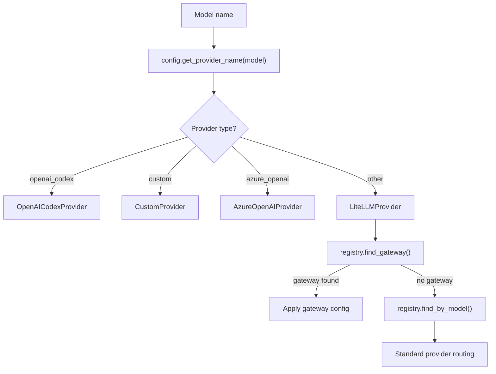

# 09 — Configuration, Security, and Runtime Constraints

## Config Architecture

### Config Loading Chain

```
~/.nanobot/config.json (or --config flag)
  → config/loader.py: load_config()
    → _migrate_config() — forward-compatibility migrations
    → config/schema.py: Config.model_validate() — Pydantic validation
  → Config object
```

### Schema Overview (`config/schema.py`)

```python
class Config(BaseModel):
    agents: AgentsConfig           # Agent-level settings
    providers: ProvidersConfig     # LLM provider credentials
    channels: ChannelsConfig       # Channel adapter configs
    gateway: GatewayConfig         # Gateway-level settings

class AgentsConfig(BaseModel):
    defaults: AgentDefaultsConfig  # Default agent settings

class AgentDefaultsConfig(BaseModel):
    model: str                     # Default LLM model name
    workspace: str                 # Path to workspace directory
    tools: ToolsConfig             # Tool-level settings
    mcp_servers: dict[str, MCPServer]  # MCP server configs

class ToolsConfig(BaseModel):
    exec: ExecConfig               # Shell tool settings

class ExecConfig(BaseModel):
    timeout: int = 60              # Default command timeout
    deny_patterns: list[str]       # Regex deny list
    allow_patterns: list[str]      # Regex allow list
    restrict_to_workspace: bool    # Lock to workspace dir
    path_append: str               # Additional PATH entries

class MCPServer(BaseModel):
    command: str | None            # stdio transport command
    args: list[str]                # Command arguments
    url: str | None                # HTTP/SSE transport URL
    type: str | None               # Force transport type
    env: dict[str, str] | None     # Environment variables
    headers: dict[str, str] | None # HTTP headers
    enabled_tools: list[str]       # Tool whitelist (* = all)
    tool_timeout: int = 30         # Per-tool timeout

class ProvidersConfig(BaseModel):
    # One field per known provider
    openai: ProviderConfig
    anthropic: ProviderConfig
    deepseek: ProviderConfig
    gemini: ProviderConfig
    # ... etc (20+ providers)

class ProviderConfig(BaseModel):
    api_key: str = ""
    api_base: str = ""
    extra_headers: dict[str, str] = {}
    model: str = ""                # Override default model
    temperature: float | None      # Override generation temperature
    max_tokens: int | None         # Override max tokens
    reasoning_effort: str | None   # Override reasoning effort

class ChannelsConfig(BaseModel):
    send_progress: bool = True     # Send "thinking" status
    send_tool_hints: bool = True   # Send tool execution hints
    telegram: TelegramConfig | dict
    discord: DiscordConfig | dict
    # ... etc

class GatewayConfig(BaseModel):
    heartbeat_interval: int = 1800  # 30 minutes
    heartbeat_enabled: bool = True
    consolidation_threshold: int = 50  # Messages before consolidation
```

### Provider Resolution (`_make_provider` in `cli/commands.py`)



## Security Boundaries

### 1. Shell Command Safety (ExecTool)

**Deny Patterns** (hardcoded defaults, overridable in config):

| Pattern | Blocks |
|---|---|
| `\brm\s+-[rf]{1,2}\b` | Recursive file deletion |
| `\bdel\s+/[fq]\b` | Windows forced delete |
| `\brmdir\s+/s\b` | Windows recursive directory delete |
| `format\b` | Disk format |
| `\b(mkfs\|diskpart)\b` | Disk operations |
| `\bdd\s+if=` | Raw disk write |
| `> /dev/sd` | Direct disk write |
| `\b(shutdown\|reboot\|poweroff)\b` | System power |
| `:()\s*\{.*\};\s*:` | Fork bomb |

**Workspace Restriction** (`restrict_to_workspace: true`):
- Blocks `../` path traversal
- Blocks absolute paths outside workspace
- Validates expanded paths against workspace root

### 2. SSRF Protection (`security/network.py`)

URL validation before any outbound HTTP request (web_fetch, MCP HTTP):

**Blocked Networks**:
- `0.0.0.0/8`, `10.0.0.0/8`, `100.64.0.0/10` (CGNAT)
- `127.0.0.0/8`, `169.254.0.0/16` (link-local / cloud metadata)
- `172.16.0.0/12`, `192.168.0.0/16`
- `::1/128`, `fc00::/7` (unique local v6), `fe80::/10` (link-local v6)

**Validation Chain**:
1. Check URL scheme is http/https
2. Resolve hostname via DNS
3. Check all resolved IPs against blocked networks
4. After redirect: re-check final URL IP address

### 3. Channel Access Control

```python
def is_allowed(sender_id):
    allow_list = config.allow_from
    if not allow_list: return False      # Empty = deny all
    if "*" in allow_list: return True    # Wildcard = allow all
    return sender_id in allow_list       # Explicit whitelist
```

Empty `allow_from` causes startup validation failure in `ChannelManager._validate_allow_from()` (fatal error).

### 4. Tool Parameter Validation

All tool calls go through `ToolRegistry.execute()`:
1. `tool.cast_params()` — schema-driven type coercion
2. `tool.validate_params()` — JSON Schema validation
3. Error results are returned to LLM with hint to try different approach

### 5. MCP Tool Filtering

MCP server tools are filtered by `enabledTools` config:
- `["*"]` — register all tools from server
- `["tool_name"]` — whitelist specific tools
- Missing tools trigger a warning log

### 6. LLM API Key Handling

- API keys stored in `config.json` (plaintext file)
- Keys set as environment variables at runtime
- No key rotation, no vault integration
- `os.environ.setdefault()` for standard providers (won't overwrite existing env)
- `os.environ[key] = value` for gateways (will overwrite)

## Runtime Constraints

| Constraint | Default | Config Path | Notes |
|---|---|---|---|
| Max tool iterations | 25 | Hardcoded | Per agent turn |
| Shell timeout | 60s | `tools.exec.timeout` | Max 600s |
| MCP tool timeout | 30s | `mcpServers.*.toolTimeout` | Per tool call |
| Output truncation | 10,000 chars | Hardcoded | Head+tail truncation |
| Session history | 500 messages | Hardcoded | Sliding window |
| Consolidation threshold | 50 messages | `gateway.consolidationThreshold` | Triggers memory consolidation |
| Heartbeat interval | 1800s (30min) | `gateway.heartbeatInterval` | Timer period |
| LLM retry delays | 1s, 2s, 4s | Hardcoded | Exponential backoff |
| Message split size | 2000 chars | Hardcoded | For Discord compatibility |

## File System Layout (Runtime)

```
~/.nanobot/                      # Default data root
├── config.json                  # Configuration
└── cron/
    └── jobs.json                # Cron job persistence

workspace/                       # (configurable)
├── AGENTS.md                    # Agent instructions
├── SOUL.md                      # Personality
├── USER.md                      # User profile
├── TOOLS.md                     # Tool notes
├── HEARTBEAT.md                 # Heartbeat tasks
├── memory/
│   ├── MEMORY.md                # Consolidated memory
│   └── HISTORY.md               # Conversation log
├── sessions/
│   └── {key}.jsonl              # Per-session message logs
└── skills/
    └── {name}/SKILL.md          # User-defined skills
```
