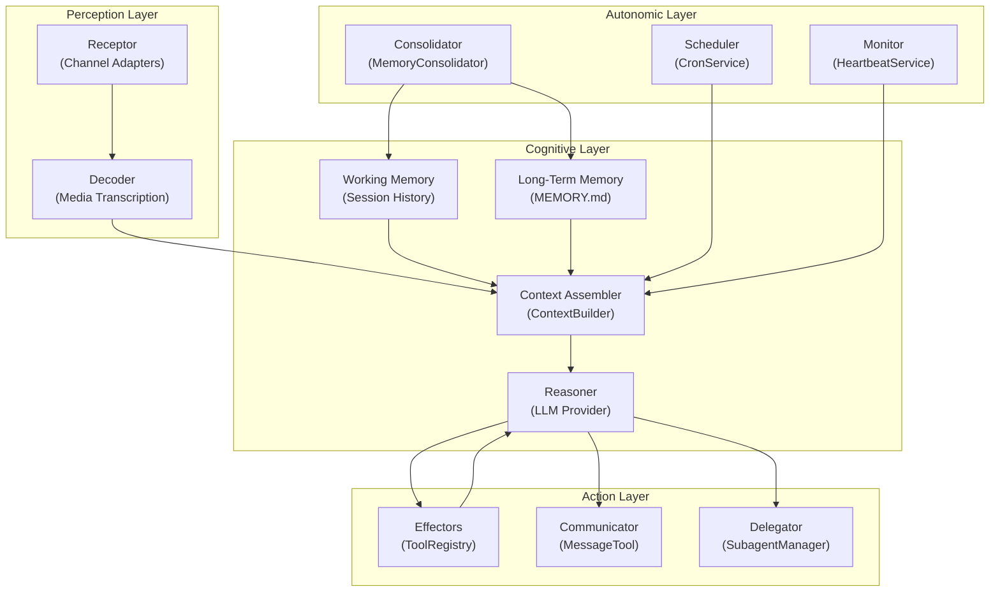

# 10 — Research-Level Component Abstraction

## Agent Component Model

Abstracting from the implementation, nanobot's agent can be modeled as a composition of these conceptual components:



## Component Taxonomy

### 1. Receptors (Perception)

| Component | Implementation | Function |
|---|---|---|
| Channel Adapter | `BaseChannel` subclasses | Translate platform-specific messages into `InboundMessage` |
| Media Decoder | `transcribe_audio()` | Convert voice/audio to text using Groq Whisper |
| Access Gate | `is_allowed()` | Accept/reject messages based on sender identity |

**Abstraction Pattern**: Strategy pattern via `BaseChannel` ABC. Each adapter is a complete, independent module with no shared state between adapters.

### 2. Working Memory

| Component | Implementation | Function |
|---|---|---|
| Session Store | `Session` + `SessionManager` | Append-only message log per conversation |
| History Window | `get_history(max_messages)` | Sliding window over unconsolidated messages |
| Legal Start Finder | `_find_legal_start()` | Ensure tool-call/result pairs are complete |

**Model**: Append-only log with a consolidation pointer. This is structurally similar to a **write-ahead log** in databases — the frontier advances when entries are flushed to long-term storage.

### 3. Long-Term Memory

| Component | Implementation | Function |
|---|---|---|
| Semantic Store | `MEMORY.md` | Accumulated facts, preferences, context |
| Episodic Log | `HISTORY.md` | Chronological conversation summaries |
| Consolidator | `MemoryConsolidator` | LLM-driven compression of working memory |

**Model**: Two-tier storage with an **LLM as the compression function**. This is a key architectural choice — the lossy compression of memory consolidation is delegated to the same reasoning engine that produces the agent's outputs.

### 4. Context Assembler

| Component | Implementation | Function |
|---|---|---|
| System Prompt Builder | `ContextBuilder.build_messages()` | Compose identity + knowledge + tools + history |
| Skills Loader | `SkillsLoader` | Load relevant skills into prompt |
| Runtime Injector | Runtime context block | Add time, OS, workspace info |

**Pattern**: This is a **prompt template engine** with ordered composition. The template is implicit (concatenation with separators) rather than explicit (e.g., Jinja2).

### 5. Reasoner

| Component | Implementation | Function |
|---|---|---|
| LLM Provider | `LLMProvider` ABC | Abstract interface to language models |
| Retry Engine | `chat_with_retry()` | Resilience layer with transient error detection |
| Response Parser | `_parse_response()` | Extract content, tool calls, thinking blocks |

**Model**: The reasoner is a **black box**. Nanobot makes no assumptions about the LLM's internal reasoning process. There is no chain-of-thought forcing, no structured reasoning prompts, and no meta-cognitive loops. The system relies entirely on:
1. Good system prompt design
2. Tool availability signaling
3. Model capability

### 6. Effectors (Action)

| Component | Implementation | Function |
|---|---|---|
| File I/O | `ReadFileTool`, `WriteFileTool`, `EditFileTool` | Filesystem interaction |
| Shell | `ExecTool` | Command execution with safety guards |
| Web | `WebSearchTool`, `WebFetchTool` | Information retrieval |
| MCP | `MCPToolWrapper` | Extension via external tool servers |
| Communication | `MessageTool` | Channel message delivery |
| Delegation | `SpawnTool` | Background task spawn |

**Model**: Effectors follow the **function-calling** pattern standardized by OpenAI. Each tool is a self-contained unit with JSON schema for parameters and string return values.

### 7. Autonomic Functions

| Component | Implementation | Function |
|---|---|---|
| Scheduler | `CronService` | Time-based task execution |
| Monitor | `HeartbeatService` | Periodic environment sensing |
| Consolidator | `MemoryConsolidator` | Background memory maintenance |
| Evaluator | `evaluate_response()` | Post-action notification gating |

**Model**: Autonomic functions operate independently of user input. They share the same agent capabilities but are triggered by internal timers rather than external messages. The **evaluator** is notable as a **self-monitoring function** — it uses an LLM to judge the output of another LLM call.

## Architectural Patterns

### Pattern 1: Single-Loop Agent

```
while True:
    input = perceive()
    context = assemble(input, memory, identity)
    action = reason(context)
    if action.is_tool_call:
        result = execute(action)
        feedback(result)
    else:
        respond(action)
```

This is the classical **ReAct (Reason + Act)** pattern, implemented as a simple while loop rather than a formal state machine.

### Pattern 2: Memory as Lossy Compression

```
Working memory fills → exceed threshold → LLM compresses → update long-term memory
```

The compression is **lossy by design** — the LLM decides what's important to keep. This mirrors human memory consolidation during sleep, where the brain replays and compresses daily experiences.

### Pattern 3: Tool-Call as Action Space

The agent's action space is defined entirely by the registered tools. There are no built-in actions, no hardcoded behaviors. Even sending a message to the user is a tool call (`message` tool).

### Pattern 4: Channel as Receptor + Effector

Each channel adapter serves dual roles:
- **Receptor**: converts platform events to `InboundMessage`
- **Effector**: converts `OutboundMessage` to platform sends

The bus provides temporal decoupling between these roles.

## Comparison with Other Agent Architectures

| Feature | Nanobot | AutoGPT | LangChain | CrewAI |
|---|---|---|---|---|
| Multi-agent | Spawn only | 4 agents | Chains | Multi-role |
| Planning | None | Task list | Prompt chains | Role-based |
| Memory | File-based, LLM consolidation | Pinecone/Weaviate | VectorStores | Shared memory |
| Tool protocol | OpenAI function calling | Custom | Tools/Agents | Tools |
| Orchestration | Single loop | Manager | Chain/Graph | Sequential/Parallel |
| State machine | None | Finite | LCEL DAG | Sequential |

Nanobot is architecturally closer to a **personal butler** than an **autonomous agent** — it responds to requests with tool use but doesn't independently plan or decompose goals.
