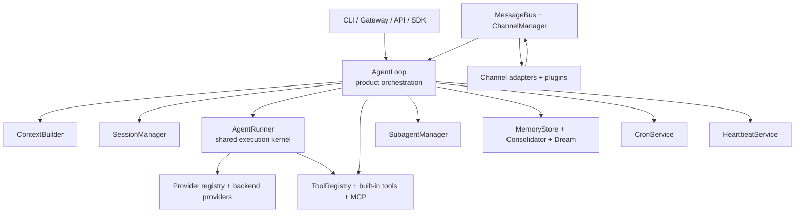

# 13 — Current Runtime Refresh

This document refreshes the older architecture analysis against the current
checkout in this repository, which is `v0.1.5` in [pyproject.toml](../../pyproject.toml).

The older `00`-`12` documents are still useful, but they describe an earlier
runtime shape. The largest source of confusion is that nanobot is no longer
"just `AgentLoop` plus LiteLLM plus `HISTORY.md`".

## Executive Summary

The current nanobot runtime is best understood as a layered system:

1. `AgentLoop` orchestrates product behavior: sessions, slash commands,
   channels, MCP connection, progress streaming, checkpoint recovery,
   consolidation scheduling, and outbound delivery.
2. `AgentRunner` is the reusable tool-using execution kernel shared by the
   main loop, subagents, and Dream memory editing.
3. `ContextBuilder` assembles the prompt from identity templates, workspace
   bootstrap files, durable memory, active skills, and recent summarized
   history.
4. Memory is now explicitly two-stage:
   `Consolidator` writes compressed summaries into `memory/history.jsonl`,
   then `Dream` re-reads those summaries and incrementally edits
   `SOUL.md`, `USER.md`, and `memory/MEMORY.md`.
5. The provider layer is no longer LiteLLM-centered. The current registry maps
   models to multiple native backends such as `openai_compat`, `anthropic`,
   `azure_openai`, `openai_codex`, and `github_copilot`.
6. nanobot now exposes more than the CLI and chat gateway. The repo also ships
   a Python SDK facade in [`nanobot.py`](../../nanobot/nanobot.py) and an
   OpenAI-compatible HTTP API in [`api/server.py`](../../nanobot/api/server.py).

## Current Mental Model

## Runtime Entry Points

The older analysis focused mostly on the CLI gateway. The current repo has
four meaningful runtime surfaces:

- CLI in [`nanobot/cli/commands.py`](../../nanobot/cli/commands.py)
- Chat gateway mode in [`nanobot/cli/commands.py`](../../nanobot/cli/commands.py)
- Python SDK facade in [`nanobot/nanobot.py`](../../nanobot/nanobot.py)
- OpenAI-compatible API server in [`nanobot/api/server.py`](../../nanobot/api/server.py)

This matters because the reusable center of gravity has shifted from
"`AgentLoop` is everything" to "`AgentRunner` is the common execution core and
`AgentLoop` is the application shell around it".

## What Each Core Module Owns Now

### `nanobot/agent/loop.py`

`AgentLoop` is still the top-level coordinator, but it is no longer the only
place where the agent execution semantics live.

Current responsibilities:

- lazy MCP connection and registration
- default tool registration
- per-session dispatch locking
- global concurrency gating via `NANOBOT_MAX_CONCURRENT_REQUESTS`
- slash-command routing
- progress and streaming event emission
- runtime checkpoint persistence and recovery
- session save/restore
- scheduling token-based consolidation after each turn

Important change: the older docs describe a single global processing lock.
The current code uses per-session locks plus an optional global semaphore, so
different sessions can progress concurrently.

### `nanobot/agent/runner.py`

`AgentRunner` is the shared ReAct-style execution engine.

Current responsibilities:

- LLM request loop
- streaming hook callbacks
- concurrent tool execution
- tool-result normalization and truncation
- history micro-compaction
- blank-response retry
- truncated-response recovery
- checkpoint emission for interrupted runs

This file is the clearest place to understand the actual "agent loop" today.

### `nanobot/agent/context.py`

`ContextBuilder` now assembles a richer prompt than the older docs describe.

It includes:

- identity and platform policy templates
- workspace bootstrap files: `AGENTS.md`, `SOUL.md`, `USER.md`, `TOOLS.md`
- long-term memory from `memory/MEMORY.md`
- always-on skills and a skills summary
- recent summarized history read from `memory/history.jsonl`
- runtime metadata injected ahead of the current user turn
- optional multimodal image blocks

### `nanobot/agent/memory.py`

Memory is no longer best described as "`MEMORY.md` plus `HISTORY.md`".

Current design:

- `Consolidator` compresses evicted session history into `memory/history.jsonl`
- `Dream` reads new JSONL entries in batches
- `Dream` runs a two-phase flow:
  plain LLM analysis first, then targeted file edits through `AgentRunner`
- `GitStore` versions durable memory edits when the workspace is a git repo
- legacy `HISTORY.md` is only a migration source now

### `nanobot/providers/registry.py`

The provider layer has changed materially.

The current registry dispatches to backend types including:

- `openai_compat`
- `anthropic`
- `azure_openai`
- `openai_codex`
- `github_copilot`

The older analysis repeatedly calls LiteLLM the main abstraction. That is now
wrong for this checkout. The repo uses native SDK-backed providers and an
OpenAI-compatible provider implementation instead.

### `nanobot/channels/registry.py`

Channel discovery is no longer only built-in module loading.

The current registry:

- scans built-in channel modules with `pkgutil`
- loads external channel plugins through `entry_points(group="nanobot.channels")`
- lets built-in channels win if a plugin tries to shadow a built-in name

### `nanobot/api/server.py` and `nanobot/nanobot.py`

These modules are new enough that the older architecture notes do not model
them at all.

- `api/server.py` exposes a fixed-session OpenAI-compatible API
- `nanobot.py` provides a programmatic facade for embedding nanobot in Python

## End-to-End Request Flow Today

### Gateway or channel-driven turn

1. A channel adapter publishes an `InboundMessage` to the `MessageBus`.
2. `AgentLoop.run()` consumes it and routes priority slash commands early.
3. `_dispatch()` applies per-session serialization and an optional global
   concurrency gate.
4. `_process_message()` restores any interrupted runtime checkpoint, loads the
   session, runs slash-command handlers, and triggers token-based consolidation.
5. `ContextBuilder.build_messages()` constructs the prompt.
6. `_run_agent_loop()` delegates the actual LLM-tool loop to `AgentRunner`.
7. `AgentRunner` may stream output, execute tools concurrently, and persist
   checkpoints between tool phases.
8. `AgentLoop` saves the new messages into the session, clears the checkpoint,
   persists the session, and schedules another background consolidation check.
9. The response is published back to the outbound bus unless the `message`
   tool already delivered during the turn.

### Direct SDK or API turn

The direct path is thinner than gateway mode:

- SDK and API call `AgentLoop.process_direct(...)`
- `process_direct(...)` creates an `InboundMessage` in-memory
- the same `_process_message()` path handles the turn

## Background and Autonomic Flows

The older docs were directionally right that nanobot has proactive runtime
services, but the details have evolved.

### Cron

[`nanobot/cron/service.py`](../../nanobot/cron/service.py) now persists jobs in
JSON, merges multi-instance actions from an append-only action log, and tracks
per-run history. This is more than a simple timer wrapper.

### Heartbeat

[`nanobot/heartbeat/service.py`](../../nanobot/heartbeat/service.py) now runs a
two-phase decision model:

1. ask the LLM, via a virtual `heartbeat` tool schema, whether work exists
2. only run the full agent turn when the decision says `run`

### Subagents

[`nanobot/agent/subagent.py`](../../nanobot/agent/subagent.py) is still not a
full multi-agent planner, but nanobot is no longer accurately described as
"avoiding multi-agent orchestration" in absolute terms. It supports background
subagents with their own tool loop, result announcement, and session-scoped
cancellation.

## Biggest Mismatches With The Older Analysis

| Older analysis claim | Current repo reality |
|---|---|
| Provider layer is primarily LiteLLM | LiteLLM has been removed from the main path; provider dispatch now targets native backends and `OpenAICompatProvider` |
| Memory centers on `HISTORY.md` | `history.jsonl` is the live archive; `HISTORY.md` is legacy migration input |
| `AgentLoop` owns the whole tool-using execution algorithm | `AgentRunner` now owns the shared LLM-tool loop used by the main agent, Dream, and subagents |
| One message processed at a time globally | Current code serializes per session and uses an optional global semaphore for bounded concurrency |
| Skills are only prompt assets | Mostly still true, but the runtime now also has stronger plugin surfaces: MCP tools, channel plugins, SDK, and API |
| No planning/reflection/background orchestration | There is still no heavyweight planner, but there are subagents, Dream, heartbeat, slash commands, checkpoint recovery, and background scheduling |
| Gateway is the main runtime surface | CLI, gateway, SDK, and OpenAI-compatible API are all first-class entry points now |

## Best Reading Order For The Current Codebase

If your goal is to understand the code quickly, read in this order:

1. [`nanobot/agent/runner.py`](../../nanobot/agent/runner.py)
2. [`nanobot/agent/loop.py`](../../nanobot/agent/loop.py)
3. [`nanobot/agent/context.py`](../../nanobot/agent/context.py)
4. [`nanobot/agent/memory.py`](../../nanobot/agent/memory.py)
5. [`nanobot/providers/registry.py`](../../nanobot/providers/registry.py)
6. [`nanobot/cli/commands.py`](../../nanobot/cli/commands.py)
7. [`nanobot/command/router.py`](../../nanobot/command/router.py)
8. [`nanobot/api/server.py`](../../nanobot/api/server.py)
9. [`nanobot/nanobot.py`](../../nanobot/nanobot.py)
10. [`nanobot/channels/manager.py`](../../nanobot/channels/manager.py)
11. [`nanobot/channels/registry.py`](../../nanobot/channels/registry.py)

## Practical Takeaway

If you keep one mental model in your head, make it this:

- `AgentLoop` is the application orchestrator
- `AgentRunner` is the reusable execution kernel
- `ContextBuilder` decides what the model sees
- `Consolidator` and `Dream` decide what the system remembers
- the provider registry decides how a model name becomes a real backend call

That model matches the current repo much more closely than the older
"single-loop lightweight agent around LiteLLM" framing.
